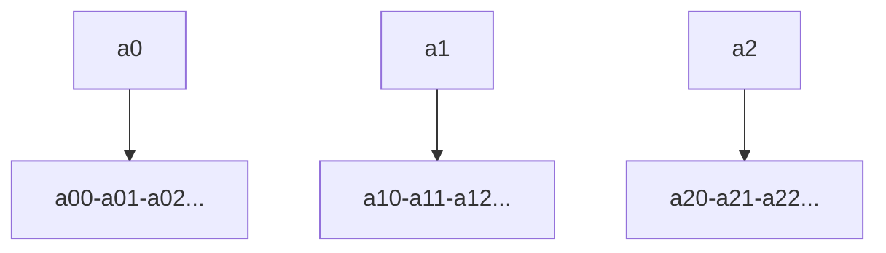
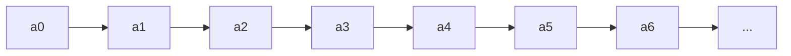
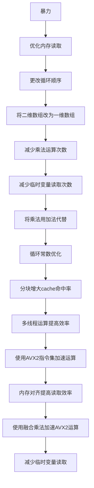

# C++ Project1

11912823 刘旭坤

### 要点实现

1. ```(20 points) Please define a Struct for matrices. The Struct should contain the property descriptions such as the number of rows, the number of columns, data, etc.```

   程序使用```Struct```封装了矩阵运算。代码如下：

   ```c++
   float *matrix;
   int n, m;
   Matrix(int n, int m)
   {
       //matrix = new float[n * m + 10];
       matrix = (float *)aligned_alloc(32, (n * m + n * m % 32 + 32) * sizeof(float));
       this->n = n;
       this->m = m;
   }
   ```

2.```(30 points) Please implement a function which can compute the matrix product of two matrices. If the sizes of the two input matrices do not match, the function should report
   errors. The function must be robust and cannot crash when you input something```

​	程序提供了10种效率不同的算法计算矩阵乘法，且在运算开始前会先判断二者是否可以相乘，不会因此崩溃。代码如下：

```c++
Matrix ans(this->n, b.m);
if (this->m != b.n)
{
    puts("Error:These two matrices can not be product!");
    return ans;
}
```

3. ```(10 points) Please measure how many milliseconds (or seconds) for the multiplication when the two matrices contain about 200M elements.```

   程序计时结果及对比见文末。

4. ```(25 points) Improve the efficiency of your source code. Please report your methods and the improvements. Deep analysis and comparisons are expected in the report.```

5. ```(10 points) Compare your implementation with OpenBLAS```

   对比见文末。代码如下：

   ```c++
   void openblas_test(int M,int N,int K)
   {
       float *A = new float[M * K];
   	float *B = new float[K * N];
   	float *C = new float[M * N];
   	cblas_sgemm(CblasRowMajor, CblasNoTrans, CblasNoTrans, M, N, K, 1, A, K, B, N, 0, C, N);
   }
   ```

   

6. ``` (5 points) Please host your source code at GitHub.com. you can just put a link in the report. If you do not host your source code at GitHub.com, please upload your source with your report to Blackboard.```

### 优化思路

对于此次Project，我先从暴力算法的角度进行分析，找出当前算法存在的瓶颈进行针对性的优化。在此，我利用Linux下的time命令分类记录程序的运行时间。其中real为程序运行的总时间。主要包含包含初始化矩阵，填充矩阵，矩阵运算三个过程。user为程序使用CPU的时间，也就是程序真正被CPU执行的时间。首先使用暴力运算计算1000*1000的矩阵自乘，得到的结果如下：


对于矩阵乘法这类涉及到繁琐计算和频繁内存读取的算法，内存读取的时间会占据程序执行的大部分时间。因此我首先尝试从内存读取方面进行优化。

对于一个二维数组，对于行变量的连续访问效率在大多数情况下由于对列数据的访问。这是由于二维数组的行地址连续，而列地址则不然。这种内存访问不连续的情况会导致cache命中效率低下。而内存的读取速度远低于CPU缓存，所以大大降低了计算的效率。因此我首先尝试降低列数据读取的次数，减少不必要的列访问。

对于初始的朴素算法，我采用**i,j,k**的循环顺序，此时变量**k**位于三层循环的最内部，控制行的变化。所需行变换的次数最多。因此尝试将控制行变换的变**k**移到循环外侧，加大cache的命中率。结果如下：


可以发现程序得到了10%左右的提升。

通过上面的思路，尝试进一步优化内存访问。既然对列的访问会降低数据读取效率与cache的命中率。根据C++内存分配的规律，虽然二维数组的地址分配与一维数组相同，但是对二维数组的访问需要先找到行对应的地址，如下图所示：




使得访问时间增大。而一维数组则不然。如下图：



可以直接访问。所以我尝试将二维数组变为一维数组，使得内存的读取更加连续。以此提升cache的命中率。测试结果如下：


但测试的结果却与预期相反，运行效率非但没有变快，反而下降了不少。代码如下：

```c++
Matrix ans(this->n, b.m);
if (this->m != b.n)
    return ans;
for (int i = 0; i < n; ++i)
{
    for (int k = 0; k < n; ++k)
    {
        for (int j = 0; j < b.m; ++j)
        {
            ans.matrix[i * n + j] += (this->matrix[tmp + k] * b.matrix[k * b.n + j]);
        }
    }
}
return ans;
```

经过与原始程序的对比，发现改进后的代码乘法运算量大大增加。这可能是问题所在，因为乘法所用的时间远大于二维数组寻址的开销。因此尝试减小乘法次数。这里再次采用先前的优化思路，将乘法运算从循环的最内层提到外层。改进后的代码如下：

```c++
Matrix ans(this->n, b.m);
if (this->m != b.n)
    return ans;
int tmp, tmpb;
for (int i = 0; i < n; ++i)
{
    tmp = i * n;
    for (int k = 0; k < n; ++k)
    {
        tmpb = k * b.n;
        for (int j = 0; j < b.m; ++j)
        {
            ans.matrix[tmp + j] += (matrix[tmp + k] * b.matrix[tmpb + j]);
        }
    }
}
return ans;
```

再次改进后程序用时如下：


这次的结果较为符合预期。运行时间较二维数组减少了25%。

既然乘法运算复杂度很高，我尝试通过以下两方面进一步减少乘法运算与内存读取次数。

+ 观察到在最内层循环中，**matrix[tmp+k]**是“只读”的，而C++对于数组的读取速度低于单独的变量，所以尝试用变量**x**代替**matrix[tmp+k]**。

+ 在先前的优化中，我虽然减少了乘法的运算次数，但如果用加法代替乘法则乘法运算还可以进一步减少。观察到**tmp**，**tmpb**的变化是有规律的，所以尝试用加法代替乘法。

代码如下：

```c++
Matrix ans(this->n, b.m);
if (this->m != b.n)
    return ans;
int tmp=-n,tmpb,x;
for (int i = 0; i < n; ++i)
{
    tmp+=n;
    tmpb=-b.n;
    for (int k = 0; k < n; ++k)
    {
        tmpb+=b.n;
        x=this->matrix[tmp + k];
        for (int j = 0; j < b.m; ++j)
        {
            ans.matrix[tmp + j] += (x * b.matrix[tmpb + j]);
        }
    }
}
return ans;
```

改进后程序用时如下：


可见运算时间得到了进一步缩小，但提升幅度比较有限。

另外，为了进一步减小多余的运算，以上代码所有的```for```循环内变量的自增均使用```++i```而不是```i++```。这是由于两者所需的运算次数不同：

+ ```i++```在```i```的值加1后会使用临时变量存储结果，再从临时变量将结果赋值给```i```

+ ```++i```则是直接加1，不经过中间变量的转换

因此在大多数情况下,```++i```比```i++```有着20%左右的效率提升。

根据以上结果，我认为这种暴力程序已经很难通过优化单个变量的cache命中率提升运行效率。因为在矩阵规模继续增大时所需要的储存空间会远远大于cache的容量。根据矩阵的运算特点和cache的命中规律，我决定对矩阵进行分块处理。将大矩阵分割成若干个小矩阵分别计算。原因如下：

+ 矩阵可以通过分块来计算，分块的形状与大小不影响答案且满足矩阵运算规律

+ 如下图，CPU的L1缓存很小，只有大小适合的矩阵才会进入L1加速运算

  

可以发现，测试平台CPU一级缓存大小为1MB。因此我尝试使用**362*362**的块大小加速计算。使用此分块方式的原因在于其能够刚好填充满CPU的数据缓存。对于```2000*2000```大小的矩阵自乘用时如下：

分块前：


分块后：


发现分块后矩阵乘法的运算速度非但没有提升，反而出现了18%左右的下降。并不符合预期。由于我使用了```inline```进行函数内联，对比未分块版本也没有增加多余的计算。因此我认为产生这种效率退化现象的原因在于分块大小不合适。为了验证这个推断，我使用```CPU-Z```查看了CPU更为详细的信息，结果如下：


可以很清晰的看出CPU一级缓存并不是一个整体，而是分为数据缓存和指令缓存两类。其中数据缓存与指令缓存各占一半且CPU每个物理核心只有```32KBytes```的数据缓存。这一数值远低于先前使用的```1M```，使得分块不仅没能优化cache反而因为多余的开销降低了程序的运行速度。

为此，我将分块大小改为```64*64```后重新计算，得到的结果如下：


虽然程序得到了一定程度的优化，但优化效果并没有达到预期。推断可能是数据量太小的原因，因此我将矩阵大小改为```5000*5000```后再次计算得到的结果如下：

|    分块    |   332   |
| :--------: | :-----: |
| **不分块** | **365** |

此时可见分块对大型矩阵的效率提升十分明显。

为了找到更为合适的分块大小，我尝试了很多其他的分块大小。但是当我尝试将分块大小改为```128*128```时发现其在数据范围较大时表现优于```64*64```。结果如下：

|  分块128   |   312   |
| :--------: | :-----: |
| **分块64** | **332** |

此时```128*128```的块大小已经超过CPU一级缓存的大小，按照此前的原理应该出现运算效率的退化。我继续调大分块大小，实验结果也符合预期，算法在分块变大时都产生了一定程度的退化。推测造成这种结果的原因在于CPU内部核心设计和总线导致的内存共享。

由于每个块之间互不影响，都可以独立计算。因此我使用多线程来提高程序执行的效率。在此我使用C++```opm.h```头文件下的```Openmp```开启多线程。语句如下：

```c++
#pragma omp parallel for num_threads(32)
```

开启多线程后结果如下：


效率提升了15倍左右，与CPU核心数量基本相同。

为了进一步提升效率，我决定使用AVX2指令集加速程序运算。对于```float```数据类型，AVX2指令集可以一次计算8个数据的乘法与加法，将大大提升程序运行效率。代码如下：

```c++
register int tmp = (I - 1) * n, tmpb = K * b.n, ii = min(n, I + Bolcksize), kk = min(n, K + Bolcksize), jj = min(b.m, J + Bolcksize);
        __m256 A, B, C, D;
        for (register int i = I; i < ii; ++i)
        {
            tmp = i * n;
            for (register int k = K; k < kk; k += 8)
            {
                tmpb = k * b.n;
                B = _mm256_loadu_ps(matrix+tmp + k);
                for (register int j = J; j < jj; j += 8)
                {
                    A = _mm256_loadu_ps(b.matrix + tmpb + j);
                    C = _mm256_loadu_ps(ans.matrix + tmp + j);
                    C = _mm256_add_ps(_mm256_mul_ps(A, B), C);
                    _mm256_storeu_ps(ans.matrix + tmp + j, C);
                }
            }
        }
```

经测试，对于```10000*10000```的矩阵，程序表现如下：


可见指令集运算极大提升了程序效率。但是以上代码使用的```_mm256_loadu_ps,_mm256_storeu_ps```函数效率较低。因此我尝试用加载速度更快的```_mm256_load_ps,_mm256_store_ps```来代替他们。因此，为了保证```_mm256_load_ps,_mm256_store_ps```可以正确运行，我需要对申请的内存做对齐处理。

先前声明数组的函数如下：

```c++
matrix = new float[n * m + 10];
```

用这种方式声名的内存不保证对齐，因此在使用```_mm256_load_ps,_mm256_store_ps```时会出现段错误。所以我在查询文档后将数组声明方式修改为以下语句：

```c++
matrix = (float *)aligned_alloc(32, (n * m + (n * m) % 32) * sizeof(float));
```

由于需要保证开辟的数组大小为32的整数倍，因此数组大小会有些许增大。在大多数情况下这种增大并不会对程序造成影响。

内存对齐后程序执行时间如下：


相比未对齐的内存读取提升了20%左右的效率。

内存读取优化完成后，我希望进一步降低程序的运算次数与读取次数。所以我使用融合乘法，也就是```_mm256_fmadd_ps```进行运算。融合乘法可以将```A*B+C```一步执行，在一定程度上减小了运算次数。

另外，为了减少内存的读取我在运算中减少了中间变量C出现的次数，将程序由原本的：

```c++
C = _mm256_load_ps(ans.matrix + tmp + j);
C = _mm256_fmadd_ps(C, B, _mm256_load_ps(ans.matrix + tmp + j));
```

更改为:

```c++
C = _mm256_fmadd_ps(_mm256_load_ps(b.matrix + tmpb + j), B, _mm256_load_ps(ans.matrix + tmp + j));
```

此外，为了加快循环与临时变量读取效率，程序中的循环变量与临时变量均使用```register```修饰，在一定程度上优化了复杂度。

最终代码如下：

```c++
inline void _BlockSum(Matrix &ans, Matrix &b, int I, int J, int K)
    {
        register int tmp = (I - 1) * n, tmpb = K * b.n, ii = min(n, I + Bolcksize), kk = min(n, K + Bolcksize), jj = min(b.m, J + Bolcksize), xx = 8 * b.n, tmpc = (K - 8) * b.n, tmpd = (K - 8) * b.n;
        __m256 A, B, C, D;
        for (register int i = I; i < ii; ++i)
        {
            tmp += n;
            tmpb = (K - 8) * b.n;
            for (register int k = K; k < kk; k += 8)
            {
                tmpb += xx;
                B = _mm256_load_ps(matrix + tmp + k);
                for (register int j = J; j < jj; j += 8)
                {
                    C = _mm256_fmadd_ps(_mm256_load_ps(b.matrix + tmpb + j), B, _mm256_load_ps(ans.matrix + tmp + j));
                    _mm256_store_ps(ans.matrix + tmp + j, C);
                }
            }
        }
    }
```

结果如下:


程序运行效率再次提升10%。

### 总结

我对于矩阵乘法优化的过程及思路如下：



通过对最开始的暴力程序的优化，我将矩阵乘法的运算效率提高了650倍。（详细的数据范围及测试结果见下图）计算225M的数据用时在7S左右。虽然表现与```OpenBlas```还有差距，但相比初始效率已经有了很大提升。

### 测试数据及结果

<center>1000*1000</center>

|             算法              |  耗时  |
| :---------------------------: | :----: |
|            2维数组            |   3s   |
|            1维数组            |  2.8s  |
|            ijk循环            | 3.48s  |
|            ikj循环            | 2.95s  |
|           1维未优化           |  4.1s  |
|           1维多线程           | 0.915s |
|             分块              | 2.65s  |
|          分块多线程           | 0.42s  |
| avx+分块+多线程+融合乘法+优化 | 0.020s |
|   avx+分块+多线程+融合乘法    | 0.023s |
|        avx+分块+多线程        | 0.030s |

<center>2000*2000</center>

|             算法              |  耗时  |
| :---------------------------: | :----: |
|            2维数组            |  24s   |
|            1维数组            | 22.1s  |
|            ijk循环            | 27.2s  |
|            ikj循环            | 22.4s  |
|           1维未优化           | 32.33s |
|           1维多线程           | 4.95s  |
|             分块              | 23.85s |
|          分块多线程           | 2.27s  |
| avx+分块+多线程+融合乘法+优化 | 0.065s |
|   avx+分块+多线程+融合乘法    | 0.067s |
|        avx+分块+多线程        | 0.087s |

<center>5000*5000</center>

|             算法              |   耗时   |
| :---------------------------: | :------: |
|            2维数组            | 386.73s  |
|            1维数组            | 364.96s  |
|            ijk循环            |  465.8s  |
|            ikj循环            | 364.03s  |
|           1维未优化           | 527.717s |
|           1维多线程           |  53.85s  |
|             分块              |  312.6s  |
|          分块多线程           |  26.92s  |
| avx+分块+多线程+融合乘法+优化 |  0.591s  |
|   avx+分块+多线程+融合乘法    |  0.616s  |
|        avx+分块+多线程        |  0.947s  |

<center>10000*10000</center>

|             算法              |  耗时   |
| :---------------------------: | :-----: |
|            2维数组            |    \    |
|            1维数组            |    \    |
|            ijk循环            |    \    |
|            ikj循环            |    \    |
|           1维未优化           |    \    |
|           1维多线程           | 380.63s |
|             分块              |    \    |
|          分块多线程           | 179.06s |
| avx+分块+多线程+融合乘法+优化 |  2.33s  |
|   avx+分块+多线程+融合乘法    |  4.70s  |
|        avx+分块+多线程        |  5.99s  |

<center>20000*20000</center>

|             算法              |  耗时  |
| :---------------------------: | :----: |
|            2维数组            |   \    |
|            1维数组            |   \    |
|            ijk循环            |   \    |
|            ikj循环            |   \    |
|           1维未优化           |   \    |
|           1维多线程           |   \    |
|             分块              |   \    |
|          分块多线程           |   \    |
| avx+分块+多线程+融合乘法+优化 | 16.72s |
|   avx+分块+多线程+融合乘法    | 28.01s |
|   avx+分块+多线程+融合乘法    | 22.3s  |

<center>OpenBlas</center>

|  数据大小   |  用时  |
| :---------: | :----: |
|  1000*1000  | 0.028  |
|  2000*2000  | 0.049  |
|  5000*5000  | 0.298  |
| 10000*10000 | 1.666  |
| 20000*20000 | 12.787 |

